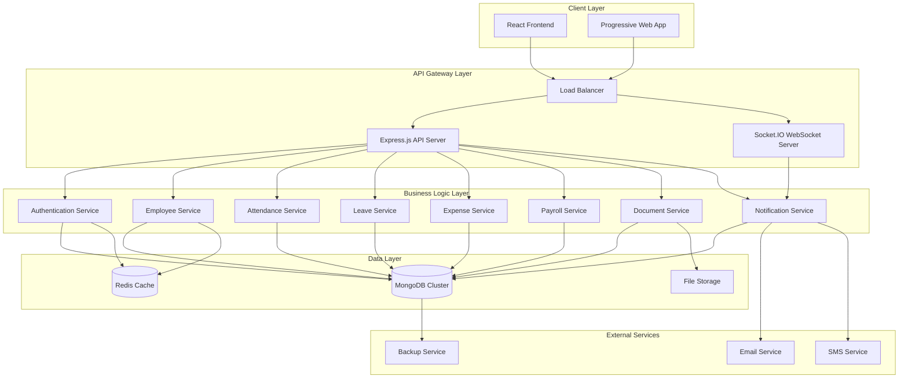

# Design Document: Employee Dashboard Production System

## Overview

The Employee Dashboard Production System transforms the existing HRMS frontend into a fully production-ready real-time system. This design maintains all existing UI components, layouts, and user experience while implementing enterprise-grade backend integration, real-time synchronization, and production security measures.

### System Architecture

The system follows a modern MERN stack architecture with the following key components:

- **Frontend**: React 18 with TypeScript, Vite build system, Tailwind CSS
- **Backend**: Node.js with Express.js, ES modules, production middleware stack
- **Database**: MongoDB with Mongoose ODM, connection pooling, and optimized indexing
- **Real-Time**: Socket.IO for bidirectional communication with room-based isolation
- **Authentication**: JWT-based with refresh tokens, session management, and security hardening
- **File Storage**: Local file system with metadata tracking and virus scanning
- **Caching**: In-memory caching for frequently accessed data
- **Monitoring**: Winston logging, health checks, and performance metrics

### Design Principles

1. **Zero UI Disruption**: Preserve all existing React components, routing, and user interfaces
2. **Enterprise Scalability**: Support 100+ concurrent users with consistent performance
3. **Real-Time First**: Implement Socket.IO for instant data synchronization across all modules
4. **Security Hardened**: Production-grade authentication, authorization, and data protection
5. **Database Driven**: Replace all mock data with MongoDB operations and proper schema validation
6. **Error Resilient**: Comprehensive error handling, graceful degradation, and automatic recovery
7. **Performance Optimized**: Connection pooling, query optimization, and response caching

## Architecture

### System Architecture Diagram



### Technology Stack

#### Frontend Stack
- **React 18.3.1**: Component-based UI with hooks and context
- **TypeScript**: Type safety and enhanced developer experience
- **Vite 6.4.2**: Fast build tool with hot module replacement
- **React Router 7.13.0**: Client-side routing with protected routes
- **Tailwind CSS 4.1.12**: Utility-first CSS framework
- **Radix UI**: Accessible component primitives
- **Socket.IO Client 4.8.3**: Real-time communication
- **Recharts 2.15.2**: Data visualization and analytics
- **React Hook Form 7.55.0**: Form management with validation

#### Backend Stack
- **Node.js 20+**: JavaScript runtime with ES modules
- **Express.js 4.21.2**: Web application framework
- **MongoDB 9.4.1**: Document database with Mongoose ODM
- **Socket.IO 4.8.3**: Real-time bidirectional communication
- **JWT**: JSON Web Tokens for authentication
- **Bcrypt 6.0.0**: Password hashing and security
- **Multer 2.1.1**: File upload handling
- **Winston 3.19.0**: Structured logging
- **Helmet 8.1.0**: Security middleware
- **Compression 1.8.1**: Response compression

#### Infrastructure Stack
- **MongoDB Atlas**: Cloud database with replica sets
- **Redis**: Session storage and caching
- **Render**: Application hosting and deployment
- **Vercel**: Frontend deployment and CDN
- **CloudFlare**: DNS and DDoS protection

## Components and Interfaces

### Core System Components

#### 1. Authentication System
**Purpose**: Secure user authentication and session management

**Key Features**:
- JWT-based authentication with refresh tokens
- Role-based access control (RBAC)
- Session persistence and timeout handling
- Multi-factor authentication support
- Account lockout and security monitoring

**API Endpoints**:
```typescript
POST /api/auth/login
POST /api/auth/logout
POST /api/auth/refresh
POST /api/auth/forgot-password
POST /api/auth/reset-password
GET /api/auth/verify-token
```

**Socket.IO Events**:
```typescript
// Client to Server
authenticate: { userId, role, tenantId }

// Server to Client
authenticated: { success: boolean }
auth_error: { message: string }
session_expired: { reason: string }
```

#### 2. Employee Management System
**Purpose**: Complete employee lifecycle management

**Key Features**:
- Employee profile management with document storage
- Organizational hierarchy and department management
- Employee onboarding workflow
- Performance tracking and reviews
- Employee directory with search and filtering

**API Endpoints**:
```typescript
GET /api/employees
POST /api/employees
GET /api/employees/:id
PUT /api/employees/:id
DELETE /api/employees/:id
GET /api/employees/department/:dept
POST /api/employees/:id/documents
```

#### 3. Attendance Management System
**Purpose**: Real-time attendance tracking and analytics

**Key Features**:
- Check-in/check-out with geolocation validation
- Break and meeting time tracking
- Overtime calculation and approval
- Attendance analytics and reporting
- Integration with leave management

**API Endpoints**:
```typescript
POST /api/attendance/checkin
POST /api/attendance/checkout
GET /api/attendance/today
GET /api/attendance/history
GET /api/attendance/analytics
PUT /api/attendance/:id
```

**Socket.IO Events**:
```typescript
// Real-time attendance updates
attendance:create: AttendanceRecord
attendance:update: AttendanceRecord
attendance:analytics: AnalyticsData
```

#### 4. Leave Management System
**Purpose**: Leave application and approval workflow

**Key Features**:
- Leave application with balance validation
- Multi-level approval workflow
- Leave balance tracking and accrual
- Holiday calendar integration
- Leave analytics and reporting

**API Endpoints**:
```typescript
GET /api/leave-requests
POST /api/leave-requests
PUT /api/leave-requests/:id/approve
PUT /api/leave-requests/:id/reject
GET /api/leave-requests/balance
GET /api/leave-requests/calendar
```

#### 5. Expense Management System
**Purpose**: Expense submission and reimbursement workflow

**Key Features**:
- Expense submission with receipt upload
- Category-based expense tracking
- Approval workflow with spending limits
- Expense analytics and reporting
- Integration with payroll for reimbursement

**API Endpoints**:
```typescript
GET /api/expenses
POST /api/expenses
PUT /api/expenses/:id/approve
PUT /api/expenses/:id/reject
GET /api/expenses/analytics
POST /api/expenses/:id/receipt
```

#### 6. Payroll Processing System
**Purpose**: Automated payroll calculation and payslip generation

**Key Features**:
- Automated salary calculation based on attendance
- Tax and deduction calculations
- Payslip generation and distribution
- Payroll analytics and reporting
- Integration with banking systems

**API Endpoints**:
```typescript
GET /api/payroll/payslips
POST /api/payroll/process
GET /api/payroll/payslip/:id
GET /api/payroll/analytics
PUT /api/payroll/config
```

#### 7. Document Management System
**Purpose**: Secure document storage and management

**Key Features**:
- Document upload with virus scanning
- Version control and audit trails
- Access control and permissions
- Document templates and generation
- Bulk document operations

**API Endpoints**:
```typescript
POST /api/documents/upload
GET /api/documents/:userId
GET /api/documents/download/:id
DELETE /api/documents/:id
POST /api/documents/generate
```

#### 8. Real-Time Notification System
**Purpose**: Instant notifications and communication

**Key Features**:
- Real-time push notifications
- Email and SMS integration
- Notification preferences and filtering
- Announcement broadcasting
- Activity feeds and updates

**Socket.IO Events**:
```typescript
// Notification events
notification:new: NotificationData
notification:read: { notificationId }
announcement:broadcast: AnnouncementData
activity:update: ActivityData
```

### Interface Specifications

#### REST API Standards
All REST APIs follow consistent patterns:

**Request Format**:
```typescript
// Headers
Authorization: Bearer <jwt_token>
Content-Type: application/json
X-Request-ID: <unique_request_id>

// Body (for POST/PUT)
{
  data: T,
  metadata?: {
    source: string,
    timestamp: string,
    version: string
  }
}
```

**Response Format**:
```typescript
{
  success: boolean,
  data?: T,
  message?: string,
  error?: {
    code: string,
    message: string,
    details?: any
  },
  metadata: {
    timestamp: string,
    requestId: string,
    version: string
  }
}
```

#### WebSocket Communication
Socket.IO events follow structured patterns:

**Event Naming Convention**:
- `module:action` (e.g., `attendance:create`, `leave:approve`)
- `system:event` (e.g., `system:maintenance`, `system:alert`)

**Event Data Structure**:
```typescript
{
  type: string,
  data: T,
  metadata: {
    timestamp: string,
    userId: string,
    tenantId: string,
    version: string
  }
}
```

## Data Models

### Database Schema Design

#### User Collection
```typescript
interface User {
  _id: ObjectId;
  name: string;
  email: string;
  password: string; // bcrypt hashed
  role: 'super_admin' | 'admin' | 'hr' | 'manager' | 'employee';
  profile: {
    firstName?: string;
    lastName?: string;
    title?: string;
    bio?: string;
    timezone: string;
    language: string;
  };
  contact: {
    phone?: string;
    mobile?: string;
    emergencyContact?: {
      name: string;
      relationship: string;
      phone: string;
    };
    address?: Address;
  };
  security: {
    twoFactorEnabled: boolean;
    passwordLastChanged: Date;
    sessionTimeout: number;
    loginHistory: LoginAttempt[];
  };
  isActive: boolean;
  avatar?: string;
  orgId: string;
  departmentId?: ObjectId;
  managerId?: ObjectId;
  lastLogin?: Date;
  preferences: UserPreferences;
  createdAt: Date;
  updatedAt: Date;
}
```

#### Employee Collection
```typescript
interface Employee {
  _id: ObjectId;
  userId: ObjectId; // Reference to User
  employeeCode: string;
  designation: string;
  department: string;
  baseSalary: number;
  hra: number;
  allowances: number;
  joiningDate: Date;
  status: 'active' | 'inactive' | 'terminated';
  orgId: string;
  createdAt: Date;
  updatedAt: Date;
}
```

#### Attendance Collection
```typescript
interface Attendance {
  _id: ObjectId;
  userId: ObjectId;
  employeeId: ObjectId;
  employeeName: string;
  date: Date;
  checkIn?: Date;
  checkOut?: Date;
  status: 'present' | 'absent' | 'on-leave' | 'half-day' | 'late';
  hoursWorked: number;
  breaks: TimeSlot[];
  meetings: TimeSlot[];
  location?: GeoLocation;
  notes?: string;
  orgId: string;
  createdAt: Date;
  updatedAt: Date;
}
```

#### Leave Request Collection
```typescript
interface LeaveRequest {
  _id: ObjectId;
  userId: ObjectId;
  employeeId: ObjectId;
  employeeName: string;
  type: LeaveType;
  startDate: Date;
  endDate: Date;
  days: number;
  reason: string;
  status: 'pending' | 'approved' | 'rejected';
  approvedBy?: ObjectId;
  approvedDate?: Date;
  rejectedBy?: ObjectId;
  rejectedDate?: Date;
  rejectionReason?: string;
  orgId: string;
  createdAt: Date;
  updatedAt: Date;
}
```

#### Expense Collection
```typescript
interface Expense {
  _id: ObjectId;
  userId: ObjectId;
  employeeId: ObjectId;
  employeeName: string;
  category: string;
  amount: number;
  currency: string;
  date: Date;
  description: string;
  receipt?: string;
  status: 'pending' | 'approved' | 'rejected';
  approvedBy?: ObjectId;
  approvedDate?: Date;
  rejectedBy?: ObjectId;
  rejectedDate?: Date;
  rejectionReason?: string;
  orgId: string;
  createdAt: Date;
  updatedAt: Date;
}
```

#### Payslip Collection
```typescript
interface Payslip {
  _id: ObjectId;
  employeeId: ObjectId;
  userId: ObjectId;
  employeeName: string;
  month: string;
  year: number;
  grossSalary: number;
  baseSalary: number;
  hra: number;
  allowances: number;
  overtime: number;
  bonus: number;
  deductions: {
    providentFund: number;
    tax: number;
    insurance: number;
    other: number;
  };
  netSalary: number;
  status: 'draft' | 'generated' | 'approved' | 'paid';
  generatedAt: Date;
  paidDate?: Date;
  orgId: string;
  createdAt: Date;
  updatedAt: Date;
}
```

### Database Indexing Strategy

#### Performance Indexes
```javascript
// User collection indexes
db.users.createIndex({ email: 1, isActive: 1 });
db.users.createIndex({ orgId: 1, role: 1 });
db.users.createIndex({ departmentId: 1, role: 1 });
db.users.createIndex({ lastLogin: -1 });

// Employee collection indexes
db.employees.createIndex({ userId: 1 }, { unique: true });
db.employees.createIndex({ orgId: 1, status: 1 });
db.employees.createIndex({ orgId: 1, department: 1 });
db.employees.createIndex({ employeeCode: 1 }, { unique: true, sparse: true });

// Attendance collection indexes
db.attendance.createIndex({ userId: 1, date: -1 });
db.attendance.createIndex({ orgId: 1, date: -1 });
db.attendance.createIndex({ userId: 1, date: 1 }, { unique: true });

// Leave requests indexes
db.leaverequests.createIndex({ userId: 1, status: 1, startDate: -1 });
db.leaverequests.createIndex({ orgId: 1, status: 1, createdAt: -1 });

// Expense collection indexes
db.expenses.createIndex({ userId: 1, status: 1, date: -1 });
db.expenses.createIndex({ orgId: 1, status: 1, date: -1 });

// Payslip collection indexes
db.payslips.createIndex({ employeeId: 1, year: -1, month: -1 });
db.payslips.createIndex({ orgId: 1, status: 1, year: -1 });
```

#### Text Search Indexes
```javascript
// User search index
db.users.createIndex({
  name: "text",
  "profile.firstName": "text",
  "profile.lastName": "text",
  email: "text"
});

// Employee search index
db.employees.createIndex({
  employeeName: "text",
  designation: "text",
  department: "text"
});
```

## Correctness Properties

*A property is a characteristic or behavior that should hold true across all valid executions of a system-essentially, a formal statement about what the system should do. Properties serve as the bridge between human-readable specifications and machine-verifiable correctness guarantees.*

### Property 1: Authentication Token Generation Consistency

*For any* valid user credentials, the Authentication System SHALL generate a JWT token with exactly 24-hour expiration and proper user claims encoding.

**Validates: Requirements 2.1**

### Property 2: Session Expiry Handling Consistency

*For any* expired session state, the Authentication System SHALL redirect to login page without breaking UI state or causing application errors.

**Validates: Requirements 2.2**

### Property 3: Database Schema Validation Consistency

*For any* employee profile data structure, the Database Layer SHALL validate against schema rules and either accept valid data or reject invalid data with specific error messages.

**Validates: Requirements 4.1**

### Property 4: Real-Time Broadcasting Reliability

*For any* attendance check-in/check-out event, the Real-Time Engine SHALL broadcast updates to all connected clients in the same organization without data loss or duplication.

**Validates: Requirements 5.1**

### Property 5: Profile Update Validation and Persistence

*For any* employee profile update request, the Profile Manager SHALL validate field constraints and either persist valid changes to MongoDB or reject invalid changes with detailed error messages.

**Validates: Requirements 6.1**

### Property 6: Attendance Timestamp Recording Accuracy

*For any* check-in event across different timezones, the Attendance Tracker SHALL record timestamps with proper timezone conversion and maintain chronological consistency.

**Validates: Requirements 7.1**

### Property 7: Leave Balance Validation Consistency

*For any* leave application request, the Leave Manager SHALL validate against current balance and company policies, ensuring no negative balances or policy violations are allowed.

**Validates: Requirements 8.1**

### Property 8: Expense Validation Rule Enforcement

*For any* expense submission data, the Expense Manager SHALL validate required fields and amount limits consistently, rejecting invalid submissions with specific error details.

**Validates: Requirements 9.1**

### Property 9: Payroll Calculation Accuracy

*For any* combination of attendance records, leave data, and deduction parameters, the Payroll Engine SHALL calculate salary components with mathematical accuracy and consistent rounding rules.

**Validates: Requirements 10.1**

## Error Handling

### Error Handling Strategy

#### 1. Global Error Handler
```typescript
interface ErrorResponse {
  success: false;
  error: {
    code: string;
    message: string;
    details?: any;
    stack?: string; // Only in development
  };
  metadata: {
    timestamp: string;
    requestId: string;
    path: string;
  };
}
```

#### 2. Error Categories
- **ValidationError**: Input validation failures
- **AuthenticationError**: Authentication and authorization failures
- **DatabaseError**: Database connection and query failures
- **BusinessLogicError**: Business rule violations
- **SystemError**: Infrastructure and system failures

#### 3. Error Recovery Mechanisms
- **Database Reconnection**: Automatic retry with exponential backoff
- **Circuit Breaker**: Prevent cascade failures in external services
- **Graceful Degradation**: Fallback to cached data when services are unavailable
- **Transaction Rollback**: Automatic rollback on multi-operation failures

#### 4. Client-Side Error Handling
```typescript
// Error Boundary Component
class ErrorBoundary extends React.Component {
  componentDidCatch(error: Error, errorInfo: ErrorInfo) {
    // Log error to monitoring service
    logger.error('React Error Boundary', { error, errorInfo });
    
    // Show user-friendly error message
    this.setState({ hasError: true, error });
  }
}

// API Error Handling
const handleApiError = (error: ApiError) => {
  switch (error.code) {
    case 'AUTHENTICATION_FAILED':
      redirectToLogin();
      break;
    case 'VALIDATION_ERROR':
      showValidationErrors(error.details);
      break;
    case 'NETWORK_ERROR':
      showOfflineMessage();
      break;
    default:
      showGenericError();
  }
};
```

#### 5. Socket.IO Error Handling
```typescript
// Connection error handling
socket.on('connect_error', (error) => {
  logger.error('Socket connection error', error);
  showConnectionError();
  
  // Attempt reconnection with exponential backoff
  setTimeout(() => socket.connect(), getBackoffDelay());
});

// Event error handling
socket.on('error', (error) => {
  logger.error('Socket event error', error);
  handleSocketError(error);
});
```

## Testing Strategy

### Testing Approach

The testing strategy employs a dual approach combining property-based testing for core business logic with comprehensive unit and integration testing for specific scenarios.

#### Property-Based Testing

Property-based testing validates universal properties across many generated inputs using **fast-check** library for JavaScript/TypeScript.

**Configuration**:
- Minimum 100 iterations per property test
- Custom generators for domain-specific data types
- Shrinking enabled for minimal failing examples
- Timeout set to 30 seconds per property

**Property Test Implementation**:
```typescript
import fc from 'fast-check';

// Property 1: Authentication Token Generation
describe('Authentication System Properties', () => {
  it('should generate valid JWT tokens for any valid credentials', () => {
    fc.assert(fc.property(
      fc.record({
        email: fc.emailAddress(),
        password: fc.string({ minLength: 6 }),
        role: fc.constantFrom('admin', 'employee', 'hr', 'manager'),
        orgId: fc.string({ minLength: 1 })
      }),
      async (credentials) => {
        const token = await authService.generateToken(credentials);
        
        // Verify token structure
        expect(token).toBeDefined();
        expect(typeof token).toBe('string');
        
        // Verify token expiration (24 hours)
        const decoded = jwt.decode(token) as any;
        const expirationTime = decoded.exp * 1000;
        const expectedExpiration = Date.now() + (24 * 60 * 60 * 1000);
        
        expect(Math.abs(expirationTime - expectedExpiration)).toBeLessThan(1000);
      }
    ), { numRuns: 100 });
  });
});

// Property 5: Profile Update Validation
describe('Profile Manager Properties', () => {
  it('should validate and persist any valid profile update', () => {
    fc.assert(fc.property(
      fc.record({
        userId: fc.string(),
        updates: fc.record({
          name: fc.string({ minLength: 1, maxLength: 100 }),
          email: fc.emailAddress(),
          phone: fc.option(fc.string()),
          department: fc.string()
        })
      }),
      async ({ userId, updates }) => {
        const result = await profileManager.updateProfile(userId, updates);
        
        if (result.success) {
          // Verify persistence
          const saved = await profileManager.getProfile(userId);
          expect(saved.name).toBe(updates.name);
          expect(saved.email).toBe(updates.email);
        } else {
          // Verify error details are provided
          expect(result.error).toBeDefined();
          expect(result.error.message).toBeTruthy();
        }
      }
    ), { numRuns: 100 });
  });
});
```

#### Unit Testing

Unit tests focus on specific examples, edge cases, and error conditions using **Jest** and **React Testing Library**.

**Coverage Requirements**:
- Minimum 80% code coverage
- 100% coverage for critical business logic
- All error paths tested
- Edge cases and boundary conditions covered

**Example Unit Tests**:
```typescript
describe('Leave Balance Calculation', () => {
  it('should calculate correct balance for annual leave', () => {
    const employee = createTestEmployee({ joinDate: '2023-01-01' });
    const balance = leaveService.calculateBalance(employee, 'annual');
    expect(balance).toBe(21); // 21 days annual leave
  });

  it('should handle negative balance gracefully', () => {
    const employee = createTestEmployee({ usedLeave: 25, totalLeave: 21 });
    expect(() => leaveService.applyLeave(employee, 1))
      .toThrow('Insufficient leave balance');
  });
});
```

#### Integration Testing

Integration tests verify component interactions and end-to-end workflows.

**Test Scenarios**:
- Complete user registration and onboarding flow
- Attendance check-in to payroll calculation pipeline
- Leave application approval workflow
- Expense submission and reimbursement process
- Real-time notification delivery

**Example Integration Test**:
```typescript
describe('Attendance to Payroll Integration', () => {
  it('should calculate payroll based on attendance records', async () => {
    // Setup test data
    const employee = await createTestEmployee();
    const attendanceRecords = await createAttendanceRecords(employee, '2024-01');
    
    // Process payroll
    const payslip = await payrollService.processPayroll(employee, '2024-01');
    
    // Verify calculations
    expect(payslip.workingDays).toBe(attendanceRecords.presentDays);
    expect(payslip.grossSalary).toBeGreaterThan(0);
    expect(payslip.netSalary).toBeLessThan(payslip.grossSalary);
  });
});
```

#### Performance Testing

Performance tests ensure system meets scalability requirements.

**Test Scenarios**:
- 100 concurrent user login simulation
- Database query performance under load
- Socket.IO connection handling capacity
- File upload performance with large files
- API response time under concurrent requests

**Example Performance Test**:
```typescript
describe('System Performance', () => {
  it('should handle 100 concurrent users', async () => {
    const users = Array.from({ length: 100 }, createTestUser);
    const startTime = Date.now();
    
    const results = await Promise.all(
      users.map(user => authService.login(user.email, user.password))
    );
    
    const endTime = Date.now();
    const duration = endTime - startTime;
    
    expect(results.every(r => r.success)).toBe(true);
    expect(duration).toBeLessThan(5000); // 5 seconds max
  });
});
```

### Test Data Management

#### Test Database Setup
- Separate test database with identical schema
- Automated test data seeding and cleanup
- Transaction-based test isolation
- Mock external services (email, SMS)

#### Test Data Generators
```typescript
// Employee data generator
const generateEmployee = () => ({
  name: faker.person.fullName(),
  email: faker.internet.email(),
  department: faker.helpers.arrayElement(['Engineering', 'HR', 'Finance']),
  salary: faker.number.int({ min: 30000, max: 150000 }),
  joinDate: faker.date.past({ years: 5 })
});

// Attendance data generator
const generateAttendance = (employee: Employee, date: Date) => ({
  employeeId: employee._id,
  date,
  checkIn: faker.date.between({ 
    from: new Date(date.setHours(8, 0)), 
    to: new Date(date.setHours(10, 0)) 
  }),
  checkOut: faker.date.between({ 
    from: new Date(date.setHours(17, 0)), 
    to: new Date(date.setHours(19, 0)) 
  })
});
```

### Continuous Integration

#### Test Pipeline
1. **Unit Tests**: Run on every commit
2. **Integration Tests**: Run on pull requests
3. **Property Tests**: Run nightly
4. **Performance Tests**: Run weekly
5. **Security Tests**: Run on deployment

#### Quality Gates
- All tests must pass
- Code coverage > 80%
- No critical security vulnerabilities
- Performance benchmarks met
- Documentation updated

<function_calls>
<invoke name="reportProgress">
<parameter name="message">Created comprehensive design document covering system architecture, components, data models, correctness properties, error handling, and testing strategy. Document addresses all 20 requirements with production-ready technical specifications.